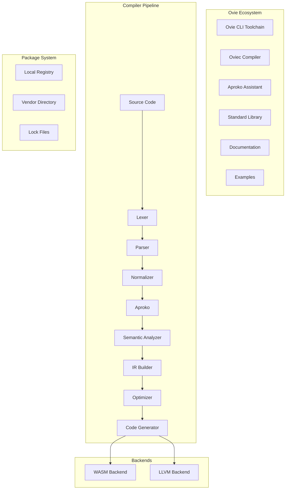

# Design Document: Ovie Programming Language

## Overview

Ovie is an enterprise-grade, self-hosting programming language designed to address fundamental challenges in modern software development through accessibility, deterministic builds, and AI/LLM integration. The language combines natural language syntax with rigorous engineering practices to create a sovereign programming environment suitable for both technical and non-technical users.

The design follows a three-stage self-hosting approach: Stage 0 (Rust bootstrap), Stage 1 (partial self-hosting), and Stage 2 (full self-hosting). This ensures the language achieves true sovereignty while maintaining enterprise-grade security and reproducibility standards.

## Architecture

### High-Level System Architecture



### Multi-Repository Structure

The Ovie ecosystem is organized across multiple focused repositories to enable independent development and maintenance:

- **ovie**: Main toolchain CLI and project management
- **oviec**: Core compiler implementation
- **aproko**: Assistant engine and guidance system
- **std**: Standard library implementation
- **docs**: Comprehensive documentation
- **spec**: Language specification and grammar
- **examples**: Sample programs and tutorials

This separation enables clear ownership boundaries, independent versioning, and focused development while maintaining coordinated releases.

### Self-Hosting Strategy

The self-hosting approach follows a proven three-stage bootstrap process:

**Stage 0 (Rust Foundation)**:
- Minimal Ovie compiler written in Rust
- Supports basic language constructs
- Interprets simple programs like `seeAm "hello world"`
- Provides foundation for Stage 1 development

**Stage 1 (Partial Self-Hosting)**:
- Lexer and parser components rewritten in Ovie
- Rust compiler compiles Ovie-written components
- Hybrid system with Rust orchestration and Ovie logic
- Enables dogfooding of language features

**Stage 2 (Full Self-Hosting)**:
- Entire compiler written in Ovie
- Bootstrap verification through hash comparison
- Rust compiler frozen for verification only
- True language sovereignty achieved

## Components and Interfaces

### Compiler Pipeline Components

**Lexer**:
- Tokenizes source code according to formal grammar
- Handles pidgin English syntax patterns
- Produces token stream for parser consumption
- Interface: `fn tokenize(source: &str) -> Vec<Token>`

**Parser**:
- Builds Abstract Syntax Tree from tokens
- Validates syntax against grammar specification
- Handles error recovery and reporting
- Interface: `fn parse(tokens: Vec<Token>) -> Result<AST, ParseError>`

**Normalizer**:
- Performs safe auto-correction of typos
- Normalizes whitespace and syntax sugar
- Logs all transformations for transparency
- Interface: `fn normalize(ast: AST) -> (AST, Vec<Correction>)`

**Aproko Engine**:
- Provides real-time code analysis and guidance
- Categorizes feedback: syntax, logic, performance, security, correctness, style
- Configurable through .ovie/aproko.toml
- Interface: `fn analyze(ast: &AST, config: &AprokoConfig) -> Vec<Suggestion>`

**Semantic Analyzer**:
- Enforces type correctness and ownership rules
- Validates state transitions and effect correctness
- Ensures memory safety and prevents common errors
- Interface: `fn analyze_semantics(ast: AST) -> Result<TypedAST, SemanticError>`

**IR Builder**:
- Generates platform-neutral intermediate representation
- Uses SSA (Static Single Assignment) form
- Produces deterministic, serializable output
- Interface: `fn build_ir(typed_ast: TypedAST) -> IR`

**Optimizer**:
- Performs target-independent optimizations
- Maintains semantic equivalence
- Configurable optimization levels
- Interface: `fn optimize(ir: IR, level: OptLevel) -> IR`

**Code Generator**:
- Supports multiple backends (WASM, LLVM)
- Produces deterministic output for same IR input
- Handles platform-specific code generation
- Interface: `fn generate_code(ir: IR, target: Target) -> Vec<u8>`

### Aproko Assistant System

The Aproko assistant provides intelligent guidance through multiple analysis categories:

**Syntax Analysis**:
- Real-time syntax validation
- Auto-correction suggestions
- Grammar compliance checking

**Logic Analysis**:
- Control flow validation
- Dead code detection
- Unreachable code identification

**Performance Analysis**:
- Algorithmic complexity warnings
- Memory usage optimization suggestions
- Performance anti-pattern detection

**Security Analysis**:
- Unsafe operation flagging
- Input validation requirements
- Security best practice enforcement

**Correctness Analysis**:
- Type safety validation
- Ownership rule enforcement
- State transition verification

**Style Analysis**:
- Code formatting suggestions
- Naming convention enforcement
- Idiomatic pattern recommendations

### Package Management System

**Local Registry**:
- Stores package metadata in ~/.ovie/registry/
- Immutable caching with cryptographic hashes
- Offline-first operation with no network dependencies during builds

**Vendoring System**:
- Dependencies stored in project vendor/ directory
- Hash-based verification for supply chain security
- Reproducible dependency resolution through lock files

**Security Model**:
- No runtime downloads or network access during builds
- Cryptographic verification of all dependencies
- Supply chain isolation through local storage

## Data Models

### Core Language Types

```rust
// Token representation
enum Token {
    Keyword(Keyword),
    Identifier(String),
    Literal(Literal),
    Operator(Operator),
    Delimiter(Delimiter),
}

enum Keyword {
    Fn, Mut, If, Else, For, While, 
    Struct, Enum, Unsafe, Return, 
    True, False, SeeAm
}

// Abstract Syntax Tree
enum AstNode {
    Program(Vec<Statement>),
    Statement(StatementKind),
    Expression(ExpressionKind),
}

enum StatementKind {
    Assignment { target: String, value: Expression, mutable: bool },
    Function { name: String, params: Vec<Parameter>, body: Block },
    Print { expression: Expression },
    If { condition: Expression, then_block: Block, else_block: Option<Block> },
    Loop { kind: LoopKind, body: Block },
}

// Intermediate Representation
struct IR {
    functions: Vec<Function>,
    globals: Vec<Global>,
    metadata: Metadata,
}

struct Function {
    name: String,
    parameters: Vec<Parameter>,
    basic_blocks: Vec<BasicBlock>,
    return_type: Type,
}

struct BasicBlock {
    label: String,
    instructions: Vec<Instruction>,
    terminator: Terminator,
}
```

### Configuration Models

```rust
// Aproko configuration
struct AprokoConfig {
    enabled_categories: Vec<AnalysisCategory>,
    severity_levels: HashMap<RuleId, Severity>,
    custom_rules: Vec<CustomRule>,
}

// Project configuration
struct ProjectConfig {
    name: String,
    version: String,
    dependencies: HashMap<String, DependencySpec>,
    build_settings: BuildSettings,
    aproko_config: Option<PathBuf>,
}

// Package metadata
struct PackageMetadata {
    name: String,
    version: String,
    hash: String,
    dependencies: Vec<Dependency>,
    build_info: BuildInfo,
}
```

### Error and Diagnostic Models

```rust
struct CompilerError {
    kind: ErrorKind,
    location: SourceLocation,
    message: String,
    suggestions: Vec<Suggestion>,
}

struct SourceLocation {
    file: PathBuf,
    line: usize,
    column: usize,
    span: Span,
}

struct Suggestion {
    category: SuggestionCategory,
    message: String,
    fix: Option<AutoFix>,
}
```

Now I need to use the prework tool to analyze the acceptance criteria before writing the Correctness Properties section:
## Correctness Properties

*A property is a characteristic or behavior that should hold true across all valid executions of a system—essentially, a formal statement about what the system should do. Properties serve as the bridge between human-readable specifications and machine-verifiable correctness guarantees.*

### Property 1: Language Grammar Compliance
*For any* valid Ovie source code, parsing then pretty-printing should produce semantically equivalent code that uses only the 13 core keywords and follows the formal grammar specification
**Validates: Requirements 1.1, 1.4, 6.2, 6.3**

### Property 2: Print Expression Correctness
*For any* valid expression following "seeAm", the compiler should output the expression's evaluated value correctly
**Validates: Requirements 1.2**

### Property 3: Type System Completeness
*For any* program using basic data types (strings, numbers, booleans, structs, enums), the type system should correctly parse, type-check, and execute operations on these types
**Validates: Requirements 1.5**

### Property 4: Safe Auto-Correction
*For any* program with safe typos, the Normalizer should correct them, log the changes, preserve semantic meaning, and never change ambiguous syntax without user consent
**Validates: Requirements 2.1, 2.2, 2.3, 2.4, 2.5**

### Property 5: Aproko Analysis Completeness
*For any* Ovie program, Aproko should provide analysis across all six categories (syntax, logic, performance, security, correctness, style) and detect ownership violations, anti-patterns, and invalid state transitions with appropriate suggestions
**Validates: Requirements 3.1, 3.2, 3.3, 3.4**

### Property 6: Aproko Configuration Compliance
*For any* valid .ovie/aproko.toml configuration, the Aproko engine should respect the configuration settings and modify its analysis behavior accordingly
**Validates: Requirements 3.5**

### Property 7: Deterministic Build Consistency
*For any* Ovie project, building the same source code multiple times on any supported platform should produce identical outputs with identical dependency resolution
**Validates: Requirements 4.1, 4.5, 7.3, 12.3**

### Property 8: Network Isolation Guarantee
*For any* build or compilation process, the system should never make unauthorized network calls and should use only locally vendored dependencies
**Validates: Requirements 4.2, 4.3, 8.4, 10.1, 10.4**

### Property 9: Dependency Security Model
*For any* dependency operation, the system should store dependencies locally with cryptographic verification, use hash-based identification, and maintain immutable caching
**Validates: Requirements 4.4, 8.1, 8.2, 8.3, 8.5**

### Property 10: Bootstrap Verification
*For any* self-hosting compilation, compiling the compiler with itself should produce hash-identical results, verifying bootstrap correctness
**Validates: Requirements 5.4**

### Property 11: Compiler Pipeline Integrity
*For any* source code compilation, the pipeline should execute all stages (Lexer → Parser → Normalizer → Aproko → Semantic Analyzer → IR → Optimizer → Codegen) in order and produce deterministic, serializable IR
**Validates: Requirements 6.1, 6.4, 6.5**

### Property 12: Multi-Backend Semantic Equivalence
*For any* IR input, all supported backends (WASM, LLVM) should produce code with identical semantic behavior, and backend selection should be configurable
**Validates: Requirements 7.1, 7.2, 7.4, 7.5**

### Property 13: CLI Command Completeness
*For any* required CLI operation, the Ovie toolchain should provide all specified commands (new, build, run, test, fmt, update, vendor) with correct functionality
**Validates: Requirements 9.1**

### Property 14: Project Scaffolding Consistency
*For any* new project creation, the system should generate standard project structure with proper configuration files and directory layout
**Validates: Requirements 9.2**

### Property 15: Testing Framework Dual Support
*For any* test suite, the testing framework should support both unit tests and property-based tests with correct execution and reporting
**Validates: Requirements 9.3**

### Property 16: Code Formatting Consistency
*For any* Ovie source file, the formatter should apply consistent style rules and produce identical output for semantically equivalent code
**Validates: Requirements 9.4**

### Property 17: Deterministic Dependency Updates
*For any* dependency update operation, the system should maintain build determinism while updating dependencies and preserving lock file integrity
**Validates: Requirements 9.5**

### Property 18: Unsafe Operation Enforcement
*For any* unsafe operation usage, the compiler should require explicit unsafe blocks and provide appropriate auditing capabilities
**Validates: Requirements 10.2**

### Property 19: Release Security Compliance
*For any* release process, the system should include cryptographic signing and ensure reproducible builds with verifiable integrity
**Validates: Requirements 10.5**

### Property 20: Error Message Quality
*For any* compilation error, the system should provide clear, actionable error messages with specific suggestions for resolution
**Validates: Requirements 11.2**

### Property 21: Multi-Repository Version Consistency
*For any* component update across repositories, the system should maintain version compatibility and coordinate releases properly
**Validates: Requirements 12.2, 12.4**

### Property 22: AI-Friendly Feedback Generation
*For any* code analysis, Aproko should provide structured feedback suitable for AI training and LLM consumption with parseable error messages
**Validates: Requirements 13.2, 13.3**

## Error Handling

### Error Categories

**Syntax Errors**:
- Lexical analysis failures
- Grammar violations
- Malformed expressions
- Recovery: Continue parsing with error nodes in AST

**Semantic Errors**:
- Type mismatches
- Ownership violations
- Undefined variables or functions
- Recovery: Type inference and suggestion generation

**System Errors**:
- File I/O failures
- Network timeouts (during dependency management)
- Insufficient permissions
- Recovery: Graceful degradation with user notification

**Build Errors**:
- Missing dependencies
- Compilation failures
- Backend-specific errors
- Recovery: Detailed diagnostics with suggested fixes

### Error Reporting Strategy

All errors follow a consistent structure:
- **Location**: Precise source location with context
- **Category**: Clear error classification
- **Message**: Human-readable description
- **Suggestions**: Actionable remediation steps
- **Code**: Unique error identifier for documentation lookup

### Aproko Integration

Aproko enhances error handling by:
- Providing contextual suggestions based on error patterns
- Learning from common mistakes to improve future guidance
- Offering multiple resolution strategies ranked by likelihood of success
- Integrating with IDE tooling for real-time feedback

## Testing Strategy

### Dual Testing Approach

The Ovie project employs comprehensive testing through two complementary approaches:

**Property-Based Testing**:
- Validates universal properties across all inputs using randomized test generation
- Each correctness property implemented as a property-based test with minimum 100 iterations
- Tests tagged with format: **Feature: ovie-programming-language, Property {number}: {property_text}**
- Focuses on universal correctness guarantees and comprehensive input coverage
- Uses appropriate property-based testing library for implementation language (QuickCheck for Rust, Hypothesis for Python, fast-check for TypeScript)

**Unit Testing**:
- Validates specific examples, edge cases, and integration points
- Focuses on concrete scenarios and boundary conditions
- Tests error handling paths and recovery mechanisms
- Validates component interfaces and API contracts
- Complements property tests by catching specific implementation bugs

### Testing Framework Requirements

**Configuration**:
- Property tests configured for minimum 100 iterations per test
- Deterministic test execution with reproducible random seeds
- Parallel test execution where safe
- Comprehensive coverage reporting

**Test Organization**:
- Tests organized by component and functionality
- Clear separation between unit and property tests
- Integration tests for cross-component interactions
- Performance benchmarks for critical paths

**Continuous Integration**:
- All tests run on every commit
- Cross-platform testing on supported targets
- Reproducibility verification for builds
- Security scanning and dependency auditing

### Self-Hosting Test Strategy

**Bootstrap Verification**:
- Hash comparison tests for self-compilation
- Cross-compilation verification
- Regression testing across bootstrap stages
- Performance benchmarking of self-hosted vs. Rust compiler

**Dogfooding Approach**:
- Ovie compiler components written in Ovie as early as possible
- Standard library implemented in Ovie
- Testing framework written in Ovie
- Documentation tools written in Ovie

This comprehensive testing strategy ensures both correctness and maintainability while supporting the ambitious goal of creating a truly sovereign programming language.