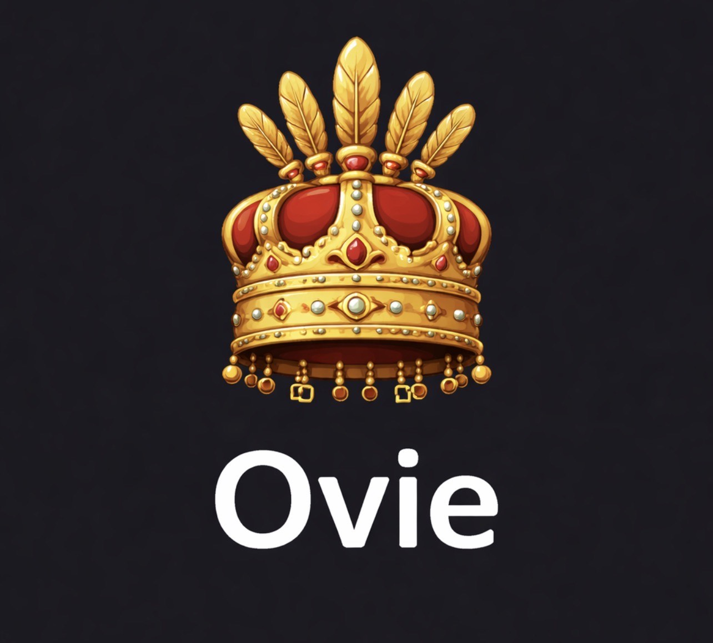

<div align="center">
  

  # Ovie — Systems Programming Made Accessible

  **v2.3.0 · Complete Module System · Self-Hosted · MIT License**

  Low-level control with high-level productivity. Direct memory management,
  natural syntax, complete standard library, and Aproko reasoning engine.

  [](https://github.com/southwarridev/ovie)
  [](https://gitlab.com/ovie1/ovie)
  [](LICENSE)
  [](RELEASE_NOTES_v2.3.md)
  [](https://southwarridev.github.io/ovie/)

  [Website](https://southwarridev.github.io/ovie/) ·
  [Book](https://southwarridev.github.io/ovie/docs/book/index.html) ·
  [Install](#installation) ·
  [Docs](#documentation) ·
  [GitHub](https://github.com/southwarridev/ovie) ·
  [GitLab](https://gitlab.com/ovie1/ovie)
</div>

---

## What is Ovie?

Ovie is a low-level programming language with high-level features. It gives you direct control over memory and hardware while keeping the syntax readable and the developer experience friendly.

```ovie
// Ovie v2.3 — Module System
use std::math::{sqrt}
use std::io::{println}
use std::core::{Result}

/// Calculate distance between two points
///
/// # Parameters
/// - x: X coordinate
/// - y: Y coordinate
///
/// # Returns
/// Euclidean distance from origin
export fn distance(x: Number, y: Number) -> Number {
    return sqrt(x * x + y * y)
}

fn main() {
    mut d = distance(3.0, 4.0)
    seeAm "Distance: " + d   // 5.0
}

main()
```

---

## What's New in v2.3

| Feature | Description |
|---------|-------------|
| **Module System** | Full `use`/`import`/`export`, dependency graph, circular detection, SHA-256 caching |
| **Aproko KB** | Persistent AI/LLM-accessible type info and reasoning rules |
| **Package Manager** | `oviec init`, `oviec add`, `oviec install`, `ovie.lock` |
| **Doc Enforcement** | Compiler requires doc comments on all exported functions |
| **std::module** | New standard library module for module system APIs |
| **std::aproko** | New standard library module for knowledge base access |

---

## Installation

### One-line install

**Windows (PowerShell — run as Administrator):**
```powershell
iwr -useb https://raw.githubusercontent.com/southwarridev/ovie/main/easy-windows-install.ps1 | iex
```

**Linux:**
```bash
curl -sSL https://raw.githubusercontent.com/southwarridev/ovie/main/easy-linux-install.sh | bash
```

**macOS:**
```bash
curl -sSL https://raw.githubusercontent.com/southwarridev/ovie/main/easy-macos-install.sh | bash
```

### Build from source

```bash
git clone https://github.com/southwarridev/ovie.git
cd ovie
cargo build --release --bin oviec
```

### Verify

```bash
oviec --version      # Ovie Compiler v2.3.0
oviec --self-check   # Full validation
```

Each installation includes:
- `oviec` — self-hosted Ovie compiler
- `ovie` — CLI and project manager
- `std/` — complete standard library (11 modules, 160KB+)
- `examples/` — 22+ runnable programs
- `docs/` — complete documentation and book

---

## Quick Start

```bash
# Create a new project
oviec new my-project
cd my-project

# Run it
oviec run src/main.ov

# Use the module system
oviec install
oviec add some-library
```

---

## Language Features

### Variables and functions
```ovie
name = "Ovie"          // immutable
mut counter = 0        // mutable

fn add(a: Number, b: Number) -> Number {
    return a + b
}

mut result = add(10, 20)
seeAm result  // 30
```

### Module system (v2.3)
```ovie
// Export from a module
export fn greet(name: String) -> String {
    return "Hello, " + name + "!"
}

// Import in another file
use std::math::{sqrt, pow}
use std::core::{Result, Option}
import "./utils.ov"
```

### Error handling
```ovie
use std::core::{Result}

fn divide(a: Number, b: Number) -> Result {
    if b == 0 { return Result.Err("Division by zero") }
    return Result.Ok(a / b)
}

mut r = divide(10, 2)
if r.is_ok() { seeAm r.unwrap() }  // 5
```

### Structs and enums
```ovie
struct Person { name: String, age: Number }
enum Status { Active, Inactive }

mut p = Person { name: "Amina", age: 28 }
seeAm p.name  // Amina
```

---

## Standard Library

| Module | Description |
|--------|-------------|
| `std::core` | Result, Option, Vec, HashMap |
| `std::math` | sqrt, pow, abs, floor, ceil, min, max |
| `std::io` | println, print, read_line |
| `std::fs` | read_file, write_file, file_exists, make_dir |
| `std::time` | now, duration_ms, sleep_ms |
| `std::env` | get_var, args, hostname |
| `std::cli` | parse_args, flag_value |
| `std::log` | info, warn, error, debug |
| `std::testing` | assert_eq, assert_true, assert_false |
| `std::module` | load_module, resolve, kb_query *(v2.3)* |
| `std::aproko` | store_entry, get_type_info, export_json *(v2.3)* |

---

## Project Structure

```
ovie/
├── oviec/          # Ovie compiler (self-hosted, Rust bootstrap)
├── aproko/         # Aproko reasoning engine
├── std/            # Standard library (11 modules)
│   ├── core/       # Result, Option, Vec, HashMap
│   ├── math/       # Mathematical functions
│   ├── module/     # v2.3 Module system
│   ├── aproko/     # v2.3 Knowledge base
│   └── ...
├── examples/       # 22+ runnable .ov programs
├── docs/           # Documentation + book
│   └── book/       # "Ovie in Southern Kaduna" — 12 chapters
├── website/        # Public website (GitHub Pages)
├── extensions/     # VS Code extension
└── spec/           # Language specification
```

---

## Documentation

- [Getting Started](https://southwarridev.github.io/ovie/docs/getting-started.html)
- [Language Guide](https://southwarridev.github.io/ovie/docs/language-guide.html)
- [Installation Guide](https://southwarridev.github.io/ovie/docs/installation.html)
- [Standard Library](https://southwarridev.github.io/ovie/docs/standard-library.html)
- [CLI Reference](https://southwarridev.github.io/ovie/docs/cli.html)
- [Aproko Guide](https://southwarridev.github.io/ovie/docs/aproko.html)
- [The Ovie Book](https://southwarridev.github.io/ovie/docs/book/index.html) — 12 chapters
- [Migration v2.2 → v2.3](docs/migration-v2.2-to-v2.3-modules.md)

---

## Roadmap

| Version | Status | Highlights |
|---------|--------|------------|
| v1.0 | ✅ Done | Core syntax, offline-first |
| v2.0 | ✅ Done | Self-hosted compiler, AST→HIR→MIR pipeline |
| v2.2 | ✅ Done | Compiler invariants, complete stdlib, Aproko |
| **v2.3** | **✅ Current** | **Module system, Aproko KB, package manager** |
| v3.0 | 🚀 Planned | JIT, package registry, IDE language server |

---

## Contributing

```bash
git clone https://github.com/southwarridev/ovie.git
cd ovie
cargo build --release --workspace
cargo test --package aproko --lib
```

See [CONTRIBUTING.md](CONTRIBUTING.md) for guidelines.

Areas: core language, standard library, Aproko rules, documentation, examples, IDE integration.

---

## Community

- **GitHub**: [github.com/southwarridev/ovie](https://github.com/southwarridev/ovie)
- **GitLab**: [gitlab.com/ovie1/ovie](https://gitlab.com/ovie1/ovie)
- **Issues**: [github.com/southwarridev/ovie/issues](https://github.com/southwarridev/ovie/issues)
- **Discussions**: [github.com/southwarridev/ovie/discussions](https://github.com/southwarridev/ovie/discussions)
- **Website**: [southwarridev.github.io/ovie](https://southwarridev.github.io/ovie/)

---

## License

MIT License — see [LICENSE](LICENSE) for details.

---

*"Low-level control meets high-level productivity — systems programming made accessible."*
