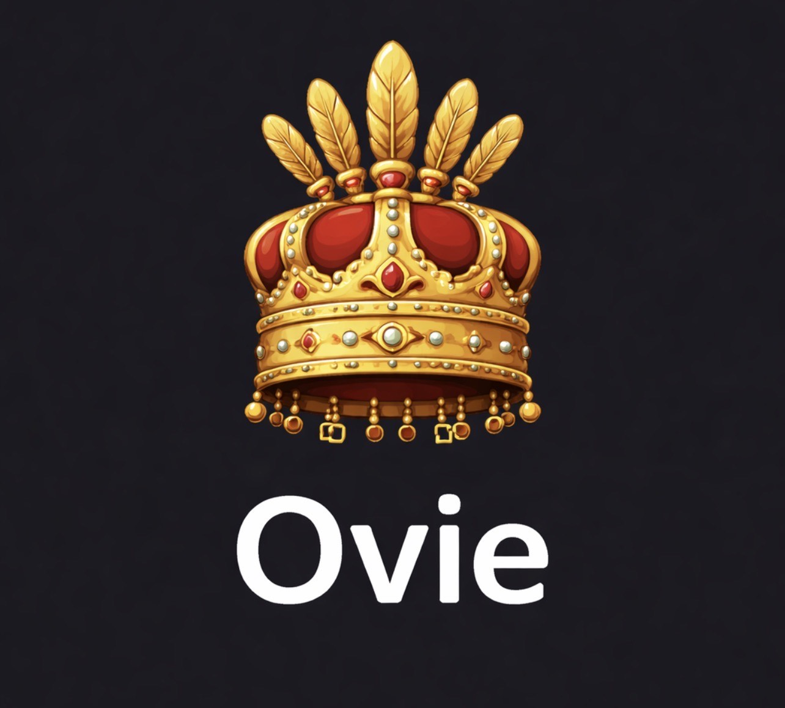

<div align="center">
  
  
  # 🚀 Ovie - Low-Level Language with High-Level Features
  
  ### ⚡ **Systems Programming Power with Developer-Friendly Abstractions**
  
  > A self-hosted programming language that combines low-level control with high-level productivity. Direct memory management meets natural syntax, complete standard library, and enforced compiler correctness.
  
  **🎉 Version: 2.2.0 (February 2026)**
</div>

[](https://github.com/southwarridev/ovie)
[](https://gitlab.com/ovie1/ovie)
[](LICENSE)
[](https://github.com/southwarridev/ovie/actions)
[](https://gitlab.com/ovie1/ovie/-/pipelines)
[](SECURITY.md)

## What is Ovie?

**Ovie is a low-level programming language with high-level features!** ⚡

Ovie combines the control and performance of systems programming with the productivity of high-level languages:

### Low-Level Control
- **Direct Memory Management**: Full control over memory allocation and layout
- **Zero-Cost Abstractions**: High-level features compile to efficient low-level code
- **Hardware Access**: System-level programming capabilities
- **Performance**: Designed for embedded systems and performance-critical applications

### High-Level Features
- **Natural Syntax**: Readable, expressive code that's easy to write and maintain
- **Complete Standard Library**: Result, Option, Vec, HashMap, and 9 core modules
- **Type Safety**: Strong type system with inference
- **Developer-Friendly**: Modern language features without sacrificing control

### Production-Ready
- **🏗️ Self-Hosted Compiler**: Ovie compiles itself - proven language maturity
- **🔒 Enforced Correctness**: Compiler invariants validated at every stage (AST → HIR → MIR → Backend)
- **📦 Complete Runtime Environment (ORE)**: Canonical structure with stdlib, aproko, and targets
- **🔍 Self-Diagnosing**: Aproko reasoning engine explains compiler decisions
- **🤖 Deterministic Builds**: Reproducible compilation with offline-first development

> **🎉 MILESTONE: Ovie v2.2 - Complete language consolidation achieved (February 2026)**

## Quick Start

```ovie
// Hello World in Ovie - Low-level power, high-level syntax
seeAm "Hello from Ovie!"

// High-level features: Complete standard library
use std::core::{Result, Option, Vec, HashMap}

fn process_data(input: Vec<String>) -> Result<HashMap<String, i32>, String> {
    mut counts = HashMap::new()
    
    for item in input {
        mut count = counts.get(item).unwrap_or(0)
        counts.insert(item, count + 1)
    }
    
    return Result::Ok(counts)
}

// Low-level control: Direct memory management
fn allocate_buffer(size: i32) -> Vec<u8> {
    mut buffer = Vec::with_capacity(size)
    // Zero-cost abstraction - compiles to efficient code
    return buffer
}

// Self-diagnosing: Aproko explains compiler decisions
// Run: oviec explain type result
fn calculate(x: i32, y: i32) -> i32 {
    mut result = x * y + 10
    return result
}
```

## Key Features

### ⚡ Low-Level Control
- **Direct Memory Management**: Full control over allocation, layout, and lifetime
- **Zero-Cost Abstractions**: High-level features compile to efficient machine code
- **Hardware Access**: System-level programming for embedded and real-time systems
- **Performance**: Designed for speed-critical applications

### 🎯 High-Level Productivity
- **Natural Syntax**: Readable code with `seeAm` for output, intuitive control flow
- **Complete Standard Library**: Result, Option, Vec, HashMap, and 9 core modules (160KB+)
- **Type Safety**: Strong type system with inference - catch errors at compile time
- **Modern Features**: Pattern matching, iterators, closures (coming soon)

### 🏗️ Production-Ready Compiler
- **Self-Hosted**: Ovie compiles itself - proven language maturity
- **Enforced Invariants**: Compiler validates itself at every stage (AST → HIR → MIR → Backend)
- **Multi-Backend**: Compile to native (LLVM), WebAssembly, or run with interpreter
- **Deterministic Builds**: Identical inputs always produce identical outputs

### 🔍 Developer Experience
- **Self-Diagnosing**: Aproko reasoning engine explains compiler decisions
  - `oviec explain error E_TYPE_004` - understand specific errors
  - `oviec explain type my_var` - see type inference reasoning
- **Structured Errors**: Clear error messages with code, location, explanation, and fix suggestions
- **Stable CLI**: Guaranteed commands (new, build, run, check, test, fmt, explain, env)
- **Complete Runtime Environment (ORE)**: Canonical structure with stdlib, aproko, targets

### 🔒 Reliability
- **Offline-First**: No network required for development - all dependencies vendored
- **Memory Safety**: Catch memory errors at compile time
- **Comprehensive Testing**: 100% critical path coverage with property-based tests
- **Cross-Platform**: Windows, macOS, Linux support

## 🚀 Installation

### Quick Install (Recommended)

Use our platform-specific installers for the easiest setup:

```bash
# Windows (PowerShell)
iwr -useb https://raw.githubusercontent.com/southwarridev/ovie/main/easy-windows-install.ps1 | iex

# Linux
curl -sSL https://raw.githubusercontent.com/southwarridev/ovie/main/easy-linux-install.sh | bash

# macOS
curl -sSL https://raw.githubusercontent.com/southwarridev/ovie/main/easy-macos-install.sh | bash
```

### Build from Source

```bash
# Clone the repository
git clone https://github.com/southwarridev/ovie.git
cd ovie

# Build and install
make build
make install
```

### Verify Installation

```bash
ovie --version          # Check version (2.2.0)
oviec --version         # Check compiler version
oviec --env             # Show runtime environment status
oviec --self-check      # Validate installation completeness
```

Each installation includes:
- Ovie compiler (oviec) and CLI (ovie)
- Complete Runtime Environment (ORE)
- Standard library (160KB+ across 9 modules)
- Aproko reasoning engine
- Documentation and 22+ examples

## 🔗 Repository Links

- **GitHub**: [https://github.com/southwarridev/ovie](https://github.com/southwarridev/ovie)
- **GitLab**: [https://gitlab.com/ovie1/ovie](https://gitlab.com/ovie1/ovie)

Both repositories are kept in sync and accept contributions.

## Usage

### Create a New Project
```bash
ovie new my-project
cd my-project
```

### Build and Run
```bash
ovie build
ovie run
```

### Other Commands
```bash
ovie test      # Run tests
ovie fmt       # Format code
ovie check     # Type check without building
oviec explain  # Explain compiler decisions
```

## Language Examples

### Basic Syntax
```ovie
// Variables
name = "Ovie"
mut counter = 0

// Functions
fn add(a, b) {
    return a + b
}

// Control flow
if counter < 10 {
    seeAm "Counter is small"
} else {
    seeAm "Counter is big"
}

// Loops
for i in 0..10 {
    seeAm i
}
```

### Data Structures
```ovie
// Structs
struct Person {
    name: String,
    age: Number,
}

// Enums
enum Color {
    Red,
    Green,
    Blue,
}

// Usage
person = Person {
    name: "Alice",
    age: 30,
}

seeAm person.name
```

### Standard Library
```ovie
use std::core::{Result, Option, Vec, HashMap}
use std::io::{println, read_line}
use std::fs::{read_file, write_file}

// Result type for error handling
fn divide(a: i32, b: i32) -> Result<i32, String> {
    if b == 0 {
        return Result::Err("Division by zero")
    }
    return Result::Ok(a / b)
}

// Option type for nullable values
fn find_user(id: i32) -> Option<String> {
    // ... lookup logic
    return Option::Some("Alice")
}
```

## Project Structure

```
ovie/
├── oviec/          # Ovie compiler (self-hosted)
├── aproko/         # Reasoning engine for diagnostics
├── ovie/           # CLI toolchain
├── std/            # Standard library (160KB+)
├── docs/           # Public documentation
├── examples/       # 22+ example programs
├── spec/           # Language specification
└── SPEC.md         # Core immutable principles
```

## Core Principles

Ovie is built on [immutable core principles](SPEC.md) that ensure:

1. **⚡ Low-level control** - direct memory management and hardware access
2. **🎯 High-level productivity** - natural syntax and complete standard library
3. **🏗️ Self-hosted compiler** - Ovie compiles itself
4. **🔒 Enforced correctness** - compiler invariants validated at every stage
5. **📦 Complete runtime environment** - canonical ORE structure
6. **🔍 Self-diagnosing** - Aproko explains compiler decisions
7. **🤖 Deterministic builds** - reproducible compilation always
8. **🔐 Offline-first** - no network required for development
9. **🛠️ Stable tooling** - guaranteed CLI commands
10. **🎯 Cross-platform** - Windows, macOS, Linux support

> **📖 Read [OFFLINE-FIRST.md](OFFLINE-FIRST.md) for detailed offline development guide**

## Documentation

- **[Language Guide](docs/language-guide.md)** - Complete language reference
- **[Getting Started](docs/getting-started.md)** - Tutorial for beginners
- **[Installation Guide](docs/installation.md)** - Detailed installation instructions
- **[CLI Reference](docs/cli.md)** - Command-line interface documentation
- **[Aproko Guide](docs/aproko.md)** - Reasoning engine configuration
- **[AI Integration](docs/ai-integration.md)** - Using Ovie with AI systems
- **[Examples](docs/examples.md)** - Code examples and patterns

## Contributing

We welcome contributions! Please see our [Contributing Guide](CONTRIBUTING.md) for details.

### Development Setup
```bash
git clone https://github.com/southwarridev/ovie.git
cd ovie
make dev-setup  # Install required tools
make dev        # Clean + build + test cycle
```

### Areas for Contribution
- Core language features
- Standard library expansion
- Aproko reasoning rules
- Documentation and examples
- Testing and benchmarks
- IDE integration
- Community building

## 🤝 Community and Support

- **GitHub Issues**: [https://github.com/southwarridev/ovie/issues](https://github.com/southwarridev/ovie/issues)
- **GitLab Issues**: [https://gitlab.com/ovie1/ovie/-/issues](https://gitlab.com/ovie1/ovie/-/issues)
- **Discussions**: [GitHub Discussions](https://github.com/southwarridev/ovie/discussions)

## 📊 Roadmap

### ✅ Completed Milestones

**v1.0.0 - Usable Language (2025)**
- Core syntax and keywords
- Basic type system
- Offline-first development
- Professional repository structure

**v2.0.0 - Self-Hosted Compiler (January 2026)**
- Ovie compiler written in Ovie
- Bootstrap verification
- Multi-stage IR pipeline (AST → HIR → MIR)

**v2.2.0 - Complete Language Consolidation (February 2026)**
- Enforced compiler invariants
- Complete Runtime Environment (ORE)
- Complete standard library (9 modules, 160KB+)
- Self-diagnosing with Aproko reasoning engine
- Stable CLI with guaranteed commands
- 100% critical path test coverage

### 🚀 Future Plans

**v3.0 - Ecosystem & Optimization**
- Package registry and ecosystem
- IDE plugins and language server
- Advanced optimization passes
- Performance improvements
- Community-driven stdlib expansion

## Security

Security is a core principle of Ovie. Please see our [Security Policy](SECURITY.md) for:
- Vulnerability reporting process
- Security features and guarantees
- Supported versions and updates

## License

Licensed under the MIT License. See [LICENSE](LICENSE) for details.

## Acknowledgments

- Inspired by the accessibility goals of natural language programming
- Built on the shoulders of giants in programming language design
- Grateful to the Rust community for excellent tooling and libraries
- Thanks to all contributors and early adopters

---

**"Low-level control meets high-level productivity - systems programming made accessible."**
